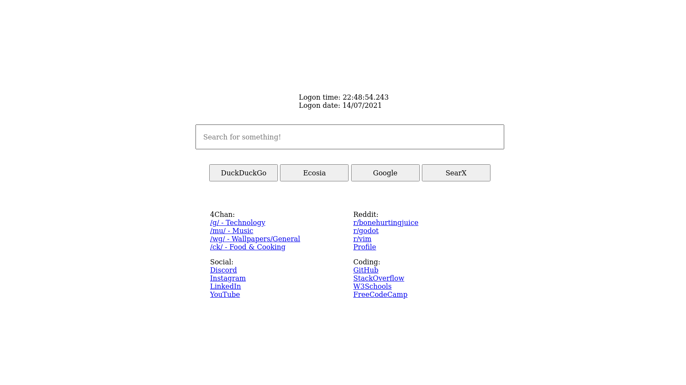

# startpages

## Describtion

Some `HTML/CSS/JS` Startpages for Qutebrowser, Vimb etc.
The idea is to create simple, editable startpages that don't eat up memory and processing power on startup, nor track your common website visits and similar data.
In short, it is a base upon which good startpages are actually made.

## Current Pages

### Truedark

Based off of [my custom Vim colorscheme](https://github.com/bratpeki/truedark-vim).

### Evening Lite

Based off of [TB-96's Evening-Startpage](https://github.com/TB-96/Evening-Startpage).

### Old-school

Inspired by 90's Internet websites.

